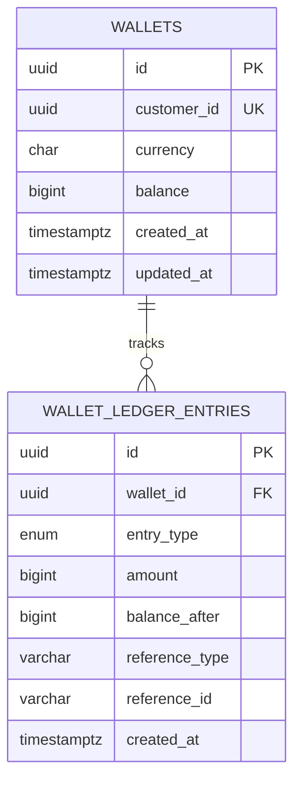

<div align="center">

# 💰 Prepaid Wallet Service

<sub>Node 20 · TypeScript · Fastify · Postgres 16 · Kysely · Vitest</sub>

<br/>

[](https://github.com/ayushj94/wallet-service/actions/workflows/ci.yml)


</div>

<br/>

> 🎯 **At a glance**
>
> - 🚫 **Never go negative.** A wallet's balance cannot drop below zero under any operation.
> - 🔁 **Never charge twice.** Retried requests with the same reference are deduped at the database layer.
> - 🏦 **Source of truth for every dollar.** Owns balances; records every movement to an append-only ledger.
> - 🪟 **Transparent.** Clients can query current balance and the full transaction history through `GET` endpoints.
> - 💱 **Multi-currency.** Five currencies (USD, EUR, GBP, CAD, INR), single currency per wallet today, extensible to cross-currency operations.
> - ✅ **54 tests** covering balance, idempotency, concurrency, transactional atomicity, and overflow.

---

## 📑 Table of Contents

1. [Prerequisites](#-1-prerequisites)
2. [Run it](#-2-run-it)
3. [Check Health](#-3-check-health)
4. [API Contracts](#-4-api-contracts)
5. [System Design](#-5-system-design)
   - [🧰 Tech stack](#-tech-stack)
   - [🗄 Table schema](#-table-schema)
   - [💰 Maintaining current balance: three approaches](#-maintaining-current-balance-three-approaches)
   - [💱 Handling currency and decimals](#-handling-currency-and-decimals)
   - [💯 Handling amount overflow](#-handling-amount-overflow)
   - [🆔 Preventing duplicate wallets](#-preventing-duplicate-wallets)
   - [🔁 Ensuring idempotency: the right scope](#-ensuring-idempotency-the-right-scope)
   - [🔒 Locking: pessimistic vs optimistic](#-locking-pessimistic-vs-optimistic)
   - [🐘 Why Postgres, not MySQL](#-why-postgres-not-mysql)
   - [📄 Pagination: cursor, not offset](#-pagination-cursor-not-offset)
6. [How we test it](#-6-how-we-test-it)
7. [Project Layout](#-7-project-layout)

---

## 🛠 1. Prerequisites

The fastest path needs **only Docker**. Everything else (Postgres, Node, dependencies, migrations) runs inside containers.

| Path | What you need installed |
| :--- | :--- |
| 🐳 **Docker (recommended)** | Docker Desktop (Mac / Windows) **or** `docker` + `docker compose` on Linux. Nothing else. |
| 🛠 **Manual setup** | Node 20+, npm (bundled with Node), and a running Postgres 16+ instance you can point at via `.env`. |

---

## ⚡ 2. Run it

### 🐳 Docker (Recommended)

```bash
docker compose up --build
```

Brings up Postgres, applies the schema on first boot, starts the service on [localhost:8080](http://localhost:8080).

### 🛠 Manual

```bash
cp .env.example .env       # point at your Postgres
npm install
npm run migrate            # applies migrations/001_init.sql
npm run dev
```

---

## 🩺 3. Check Health

Two endpoints following the standard Kubernetes pattern (`liveness` + `readiness`). Click to open them in your browser while the service is running locally:

<table>
<tr>
<th width="55%">URL</th>
<th width="45%">What it tells you</th>
</tr>
<tr>
<td><a href="http://localhost:8080/health/live"><code>GET http://localhost:8080/health/live</code></a></td>
<td>Process is alive. Always <code>200 ok</code> if the service can answer at all.</td>
</tr>
<tr>
<td><a href="http://localhost:8080/health/ready"><code>GET http://localhost:8080/health/ready</code></a></td>
<td>DB is reachable. Returns <code>200</code> if a <code>SELECT 1</code> succeeds; <code>503</code> if not.</td>
</tr>
</table>

---

## 🚀 4. API Contracts

> 📚 Also useful: [`GET /docs`](http://localhost:8080/docs) (interactive OpenAPI try-it-out UI), [`GET /docs/json`](http://localhost:8080/docs/json) (raw OpenAPI spec).

<details>
<summary><code><b>POST /wallets</b></code> · Open a wallet for a customer</summary>

<br/>

> Not idempotent. A second request with the same `customerId` returns `409`.

**Request body** (JSON Schema)

```jsonc
{
  "type": "object",
  "required": ["customerId", "currency"],
  "properties": {
    "customerId": { "type": "string", "format": "uuid" },
    "currency":   { "type": "string", "enum": ["USD", "EUR", "GBP", "CAD", "INR"] }
  },
  "additionalProperties": false
}
```

**Responses**

<details>
<summary><code>201 Created</code> · Wallet created</summary>

```jsonc
{
  "type": "object",
  "properties": {
    "id":         { "type": "string",  "format": "uuid" },
    "customerId": { "type": "string",  "format": "uuid" },
    "currency":   { "type": "string",  "enum": ["USD", "EUR", "GBP", "CAD", "INR"] },
    "balance":    { "type": "integer", "minimum": 0 },
    "createdAt":  { "type": "string",  "format": "date-time" }
  }
}
```

</details>

<details>
<summary><code>400 Bad Request</code> · Validation error</summary>

```jsonc
{
  "error": {
    "code": "VALIDATION_ERROR",
    "message": "string"
  }
}
```

</details>

<details>
<summary><code>409 Conflict</code> · Customer already has a wallet</summary>

```jsonc
{
  "error": {
    "code": "CUSTOMER_ALREADY_HAS_WALLET",
    "message": "string"
  }
}
```

</details>

**Sample cURL**

```bash
curl -X POST http://localhost:8080/wallets \
  -H 'content-type: application/json' \
  -d '{"customerId":"550e8400-e29b-41d4-a716-446655440000","currency":"USD"}'
```

</details>

<details>
<summary><code><b>POST /wallets/:id/topup</b></code> · Credit money to a wallet</summary>

<br/>

> 🔁 Idempotent on `(walletId, referenceType, referenceId)`.

**Request body** (JSON Schema)

```jsonc
{
  "type": "object",
  "required": ["amount", "currency", "referenceType", "referenceId"],
  "properties": {
    "amount":        { "type": "integer", "minimum": 1, "maximum": 9007199254740991 },
    "currency":      { "type": "string",  "enum": ["USD", "EUR", "GBP", "CAD", "INR"] },
    "referenceType": { "type": "string",  "enum": ["ORDER_SYSTEM", "PAYMENT_GATEWAY_SYSTEM"] },
    "referenceId":   { "type": "string",  "minLength": 1, "maxLength": 128 }
  },
  "additionalProperties": false
}
```

**Responses**

<details>
<summary><code>201 Created</code> · New credit recorded</summary>

```jsonc
{
  "type": "object",
  "properties": {
    "walletLedgerEntryId":        { "type": "string",  "format": "uuid" },
    "walletId":                   { "type": "string",  "format": "uuid" },
    "entryType":                  { "type": "string",  "enum": ["CREDIT"] },
    "amount":                     { "type": "integer", "minimum": 1 },
    "balanceAfter":               { "type": "integer", "minimum": 1 },
    "referenceType":              { "type": "string" },
    "referenceId":                { "type": "string" },
    "walletLedgerEntryCreatedAt": { "type": "string",  "format": "date-time" },
    "currency":                   { "type": "string",  "enum": ["USD", "EUR", "GBP", "CAD", "INR"] }
  }
}
```

`balanceAfter` is tight at `minimum: 1` because a credit applied to a non-negative balance can never land at zero.

</details>

<details>
<summary><code>200 OK</code> · Idempotent replay of an earlier credit</summary>

Same body as `201`. The HTTP status code (200 vs 201) is what signals this was a replay. `balanceAfter` reflects the value immediately after the original operation.

</details>

<details>
<summary><code>400 Bad Request</code> · Validation error</summary>

```jsonc
{ "error": { "code": "VALIDATION_ERROR", "message": "string" } }
```

</details>

<details>
<summary><code>404 Not Found</code> · Wallet doesn't exist</summary>

```jsonc
{ "error": { "code": "NOT_FOUND", "message": "string" } }
```

</details>

<details>
<summary><code>422 Unprocessable Entity</code> · Currency mismatch or amount overflow</summary>

```jsonc
{ "error": { "code": "CURRENCY_MISMATCH | AMOUNT_OUT_OF_RANGE", "message": "string" } }
```

</details>

**Sample cURL**

```bash
curl -X POST http://localhost:8080/wallets/<wallet-id>/topup \
  -H 'content-type: application/json' \
  -d '{
    "amount": 50000,
    "currency": "USD",
    "referenceType": "PAYMENT_SYSTEM",
    "referenceId": "payment-001"
  }'
```

</details>

<details>
<summary><code><b>POST /wallets/:id/deduct</b></code> · Debit money from a wallet</summary>

<br/>

> 🔁 Idempotent on `(walletId, referenceType, referenceId)`.

**Request body** (JSON Schema)

```jsonc
{
  "type": "object",
  "required": ["amount", "currency", "referenceType", "referenceId"],
  "properties": {
    "amount":        { "type": "integer", "minimum": 1, "maximum": 9007199254740991 },
    "currency":      { "type": "string",  "enum": ["USD", "EUR", "GBP", "CAD", "INR"] },
    "referenceType": { "type": "string",  "enum": ["ORDER_SYSTEM", "PAYMENT_GATEWAY_SYSTEM"] },
    "referenceId":   { "type": "string",  "minLength": 1, "maxLength": 128 }
  },
  "additionalProperties": false
}
```

**Responses**

<details>
<summary><code>201 Created</code> · New debit recorded</summary>

```jsonc
{
  "type": "object",
  "properties": {
    "walletLedgerEntryId":        { "type": "string",  "format": "uuid" },
    "walletId":                   { "type": "string",  "format": "uuid" },
    "entryType":                  { "type": "string",  "enum": ["DEBIT"] },
    "amount":                     { "type": "integer", "minimum": 1 },
    "balanceAfter":               { "type": "integer", "minimum": 0 },
    "referenceType":              { "type": "string" },
    "referenceId":                { "type": "string" },
    "walletLedgerEntryCreatedAt": { "type": "string",  "format": "date-time" },
    "currency":                   { "type": "string",  "enum": ["USD", "EUR", "GBP", "CAD", "INR"] }
  }
}
```

`balanceAfter` allows `0` because an exact-balance debit can leave the wallet at zero.

</details>

<details>
<summary><code>200 OK</code> · Idempotent replay</summary>

Same shape as `201`. HTTP status code 200 (vs 201) signals the replay.

</details>

<details>
<summary><code>400 Bad Request</code> · Validation error</summary>

```jsonc
{ "error": { "code": "VALIDATION_ERROR", "message": "string" } }
```

</details>

<details>
<summary><code>404 Not Found</code> · Wallet doesn't exist</summary>

```jsonc
{ "error": { "code": "NOT_FOUND", "message": "string" } }
```

</details>

<details>
<summary><code>422 Unprocessable Entity</code> · Insufficient balance, currency mismatch, or amount overflow</summary>

```jsonc
{
  "error": {
    "code": "INSUFFICIENT_BALANCE | CURRENCY_MISMATCH | AMOUNT_OUT_OF_RANGE",
    "message": "string"
  }
}
```

</details>

**Sample cURL**

```bash
curl -X POST http://localhost:8080/wallets/<wallet-id>/deduct \
  -H 'content-type: application/json' \
  -d '{
    "amount": 10000,
    "currency": "USD",
    "referenceType": "ORDER_SYSTEM",
    "referenceId": "order-abc-123"
  }'
```

</details>

<details>
<summary><code><b>GET /wallets/:id/balance</b></code> · Current balance</summary>

<br/>

**Responses**

<details>
<summary><code>200 OK</code> · Balance returned</summary>

```jsonc
{
  "type": "object",
  "properties": {
    "walletId": { "type": "string",  "format": "uuid" },
    "balance":  { "type": "integer", "minimum": 0 },
    "currency": { "type": "string",  "enum": ["USD", "EUR", "GBP", "CAD", "INR"] }
  }
}
```

</details>

<details>
<summary><code>400 Bad Request</code> · Non-UUID path id</summary>

```jsonc
{ "error": { "code": "VALIDATION_ERROR", "message": "string" } }
```

</details>

<details>
<summary><code>404 Not Found</code> · Wallet doesn't exist</summary>

```jsonc
{ "error": { "code": "NOT_FOUND", "message": "string" } }
```

</details>

**Sample cURL**

```bash
curl http://localhost:8080/wallets/<wallet-id>/balance
```

</details>

<details>
<summary><code><b>GET /wallets/:id/transactions</b></code> · Ledger (cursor-paginated, newest first)</summary>

<br/>

**URL pattern**

```
GET /wallets/:id/transactions?limit=<integer>&cursor=<string>
```

**Query parameters**

| Name | Type | Constraints | Default | Description |
| :--- | :--- | :--- | :--- | :--- |
| `limit` | integer | 1 – 500 | 100 | Page size. |
| `cursor` | string (UUID) | UUID format | _(none)_ | The `walletLedgerEntryId` of the last entry from the previous page. **Omit it to fetch the first page** (the most recent `limit` entries, newest first). |

**Responses**

<details>
<summary><code>200 OK</code> · Page returned</summary>

```jsonc
{
  "type": "object",
  "properties": {
    "walletId": { "type": "string", "format": "uuid" },
    "entries": {
      "type": "array",
      "items": {
        "type": "object",
        "properties": {
          "walletLedgerEntryId":        { "type": "string",  "format": "uuid" },
          "walletId":                   { "type": "string",  "format": "uuid" },
          "entryType":                  { "type": "string",  "enum": ["CREDIT", "DEBIT"] },
          "amount":                     { "type": "integer", "minimum": 1 },
          "balanceAfter":               { "type": "integer", "minimum": 0 },
          "referenceType":              { "type": "string" },
          "referenceId":                { "type": "string" },
          "walletLedgerEntryCreatedAt": { "type": "string",  "format": "date-time" }
        }
      }
    },
    "nextCursor": { "type": ["string", "null"], "format": "uuid" },
    "hasMore":    { "type": "boolean" }
  }
}
```

Feed `nextCursor` back as the `cursor` query parameter to get the next page.

</details>

<details>
<summary><code>400 Bad Request</code> · Invalid cursor or non-UUID path id</summary>

```jsonc
{ "error": { "code": "VALIDATION_ERROR", "message": "string" } }
```

</details>

<details>
<summary><code>404 Not Found</code> · Wallet doesn't exist</summary>

```jsonc
{ "error": { "code": "NOT_FOUND", "message": "string" } }
```

</details>

**Sample cURL**

```bash
curl "http://localhost:8080/wallets/<wallet-id>/transactions?limit=50"
```

</details>

---

## 🎯 5. System Design

The interesting engineering choices and the reasoning behind each.

### 🧰 Tech stack

| Tool | Role |
| :--- | :--- |
| **Node 20** | JavaScript runtime |
| **TypeScript** | Type-safe app code |
| **Fastify** | HTTP framework with first-class JSON-schema validation |
| **Postgres 16** | Database; source of truth for balances and the ledger |
| **Kysely** | Type-safe SQL query builder (not an ORM); compiles to plain SQL |
| **Ajv + ajv-formats** | JSON-schema validator; adds UUID, date-time, and other formats |
| **Pino** | Structured JSON logging, bundled with Fastify |
| **@fastify/swagger** | Auto-generates the OpenAPI 3.1 spec from route schemas |
| **Vitest** | Test framework |
| **ESLint + Prettier** | Static analysis + opinionated formatting |
| **Docker Compose** | One-command local dev (Postgres + service together) |
| **GitHub Actions** | CI: typecheck, lint, format, tests on every push and PR |


<hr/>

<br/>

### 🗄 Table schema

Two tables. `wallets` is the running balance; `wallet_ledger_entries` is the append-only audit trail. Every credit or debit writes to both inside the same DB transaction.



#### Constraints

| Where | Rule | What it guarantees |
| :--- | :--- | :--- |
| `wallets` | `UNIQUE (customer_id)` | One wallet per customer |
| `wallets` | `CHECK (balance >= 0)` | The never-negative rule, at the DB layer |
| `wallets` | `CHECK (currency IN ('USD','EUR','GBP','CAD','INR'))` | Only the whitelisted currencies |
| `wallet_ledger_entries` | `UNIQUE (wallet_id, reference_type, reference_id)` | Idempotency: same reference returns the existing entry |
| `wallet_ledger_entries` | `CHECK (amount > 0)` | Direction lives in `entry_type`; amount is unsigned |
| `wallet_ledger_entries` | `CHECK (balance_after >= 0)` | Mirrors the wallets invariant at the row level |
| `wallet_ledger_entries` | `CHECK (reference_type IN ('ORDER_SYSTEM','PAYMENT_GATEWAY_SYSTEM'))` | Only whitelisted callers can write |
| `wallet_ledger_entries` | `FOREIGN KEY (wallet_id) REFERENCES wallets(id)` | No orphan ledger entries |

> 🔑 The wallet update and the ledger insert always happen inside the **same DB transaction**. They commit together or roll back together, so the balance can never drift from the ledger.


<hr/>

<br/>

### 💰 Maintaining current balance: three approaches

There are three honest ways to answer "what is this wallet's balance right now?"

<details open>
<summary><b>A. Recompute from the ledger every time</b> · <i>rejected</i></summary>

`SUM(credits) - SUM(debits)` whenever someone asks.

| | Reads | Writes |
| --- | --- | --- |
| Cost | O(n) per request | O(n), since every debit needs the balance to check sufficiency |
| Cacheable? | ✅ on reads | ❌ on writes (a stale balance during a debit allows double-spending) |

The write path is the killer. Caching hides the read cost but cannot hide the write cost. An active wallet doing thousands of orders a day would buckle under its own success.

</details>

<details open>
<summary><b>B. Cached <code>balance</code> column, updated with every entry</b> · <i>chosen</i></summary>

Every ledger insert is paired with `UPDATE wallets SET balance = balance + signed`, inside the same transaction.

| | Reads | Writes |
| --- | --- | --- |
| Cost | O(1) primary-key lookup | O(1): one update + one insert |
| Drift risk | Impossible: same transaction makes the two writes atomic |

This is what production financial systems use (Stripe, Razorpay, banks).

</details>

<details>
<summary><b>C. Hybrid: derive balance from the latest ledger entry's <code>balance_after</code></b> · <i>rejected</i></summary>

Drop the `balance` column. Read `balance_after` from the most recent ledger entry, using the existing `(wallet_id, created_at DESC)` index.

| | Reads | Writes |
| --- | --- | --- |
| Cost | O(1) index lookup on the latest entry | O(1): just one insert (no wallet update) |
| Drift risk | Impossible by construction: no separate column to drift |

Time complexity is competitive with Option B. The reason we don't pick it is what the schema **means**:

- **The wallets table becomes a stub.** Realistic next attributes for a wallet are `status` (active / frozen), `tier` (gold / silver), `daily_spend_limit`, `frozen_until`, `kyc_level`. None of these sensibly belong on a ledger entry. With Option B the wallets table is the natural home for everything wallet-shaped; with C it shrinks to `(id, customer_id, currency)` and never grows.
- **Common queries get awkward.** "All wallets with balance over $10K" is a one-line indexed scan in B. In C you need a window function or correlated subquery over the entire ledger to pick each wallet's latest entry first. Risk dashboards, ops queries, and reporting pipelines run things like this constantly.

Plus a small edge case: a newly-created wallet has no entries yet, so the balance lookup needs a "no rows means zero" special case in application code.

</details>


<hr/>

<br/>

### 💱 Handling currency and decimals

**One currency per wallet, today.** Every wallet is created in exactly one currency and only accepts operations in that same currency. Every mutation request must include a `currency` field; if it does not match the wallet's currency, the request is rejected with `422 CURRENCY_MISMATCH` before any state changes.

**Extensible to multi-currency tomorrow.** The schema already separates currency from amount. The natural next step is cross-currency operations via a real-time FX provider (Wise, Currencylayer, Open Exchange Rates). A USD wallet receiving a EUR topup would convert at a locked-in rate and record both the original amount and the rate on the ledger entry.

**Decimals: integer minor units.** Every amount in the API is an integer in the smallest unit of the currency (cents for USD/EUR/GBP/CAD, paise for INR). This is the convention every major fintech API uses (Stripe, Razorpay, Adyen, Square, AWS Payments).

Why integer minor units?

- Integer math is exact. Floats accumulate rounding errors (`0.1 + 0.2 !== 0.3` in IEEE 754).
- JSON numbers carry numbers safely up to 2⁵³; staying as integers avoids precision loss in transit.
- The ISO 4217 standard defines the minor unit per currency (0 decimals for JPY, 2 for USD, 3 for BHD). Clients are expected to know their currency's decimal count.


<hr/>

<br/>

### 💯 Handling amount overflow

Two real limits live in the stack. Both are technical, not business.

| Layer | Limit | What happens when exceeded | Response |
| :--- | :--- | :--- | :--- |
| **API edge** (JSON schema) | `amount` ≤ `Number.MAX_SAFE_INTEGER` (2⁵³ − 1) | Above this, `JSON.parse` silently rounds | `400 VALIDATION_ERROR` |
| **Database** (BIGINT) | `balance + amount` ≤ 2⁶³ − 1 | Postgres raises SQLSTATE `22003` | `422 AMOUNT_OUT_OF_RANGE` |

The transaction rolls back on the DB error, so the wallet is unchanged.


<hr/>

<br/>

### 🆔 Preventing duplicate wallets

A `UNIQUE (customer_id)` constraint on the `wallets` table. The constraint lives in the database, not the application. Two concurrent `POST /wallets` requests with the same `customerId` cannot both succeed: one wins, the other gets a unique-key violation that the error handler maps to `409 CONFLICT`. No application-level coordination needed.


<hr/>

<br/>

### 🔁 Ensuring idempotency: the right scope

What should the dedupe key for "I have already processed this instruction" actually be?

`referenceId` is a free-form string we accept from the caller (1–128 chars). We deliberately don't force it to be a UUID, because different upstream systems already have their own ID conventions: Razorpay-style `pay_xyz`, sequential order numbers, prefixed strings, etc. Forcing them all to mint UUIDs just to talk to the wallet service would be busywork.

That decision creates a real problem if we dedupe on `referenceId` alone:

| Scope | Behaviour | Verdict |
| :--- | :--- | :--- |
| `referenceId` alone | Two different systems can easily mint the same string. `ORDER_SYSTEM` sending `"1"` and `PAYMENT_GATEWAY_SYSTEM` sending `"1"` would be deduped as the same operation, even though they're unrelated events. Beyond the collision risk, a ledger row can't even tell you which upstream system created it — useful audit, filtering, and reporting signal is lost. | ❌ Cross-system collision |
| `(referenceType, referenceId)` | Each upstream system gets its own namespace; collisions across systems disappear, and every ledger entry now carries its origin (a nice secondary benefit, independent of dedupe). `walletId` in the scope is what unlocks legitimate mass-update flows (festive cashback campaigns, disaster-relief credits). | ❌ Cross-wallet collision |
| **`(walletId, referenceType, referenceId)`** | Each wallet has its own dedupe space. Same campaign id across many wallets credits each wallet exactly once. | ✅ Correct |


<hr/>

<br/>

### 🔒 Locking: pessimistic vs optimistic

Two `/deduct` requests for $100 arrive at the same millisecond on a wallet that has $100. Only one must succeed.

<details open>
<summary><b>🐢 Pessimistic locking</b></summary>

Take a row-level lock first (`SELECT ... FOR UPDATE`), then check the balance, then mutate. Concurrent requests wait their turn.

- ✅ Simple to reason about. Easy to add more checks (status, tier, limits).
- ❌ Every request pays the lock cost, even on quiet wallets where contention is zero.

</details>

<details open>
<summary><b>🐰 Optimistic locking · <i>chosen</i></b></summary>

Atomic conditional update: `UPDATE wallets SET balance = balance + signed WHERE id = ? AND balance + signed >= 0 RETURNING balance`. Insufficient balance returns zero rows; we react to that. If a concurrent request beats us to the ledger insert, the `UNIQUE` constraint fires; we roll back and recover the winner.

- ✅ Saves one query per request on the common path (no `SELECT FOR UPDATE` needed before the mutation).
- ⚠️ When two same-reference requests collide, both run the same 5 queries; the loser just exits with `ROLLBACK` instead of `COMMIT`, leaving its tentative `UPDATE` as a tiny dead MVCC tuple for `VACUUM` to clean up. Latency-wise: indistinguishable from the happy path.

Contention is essentially zero for B2C wallets (5-10 ops/day), below 1% for small-to-medium B2B (~1,000 ops/day), and around 5% for heavy B2B (100K ops/day). In every tier, optimistic wins by a wide margin.

</details>


<hr/>

<br/>

### 🐘 Why Postgres, not MySQL

Three Postgres features make the optimistic pattern clean to write:

| Feature | Why we use it |
| :--- | :--- |
| `UPDATE ... RETURNING` | Get the new balance in the same statement as the mutation. MySQL needs a separate `SELECT` afterwards. |
| `INSERT ... ON CONFLICT DO NOTHING` | Race-safe ledger insert without try/catch on SQLSTATE codes. |
| Conditional UPDATE in one round-trip | Check-and-mutate as one atomic statement; no separate lock acquisition step. |

MySQL would work too, but every operation would need an extra round-trip. Postgres is faster on the happy path and easier to read.


<hr/>

<br/>

### 📄 Pagination: cursor, not offset

`GET /wallets/:id/transactions` is cursor-paginated. The cursor is the `id` of the last entry from the previous page; the next query fetches entries strictly older than that anchor.

**`?page=N` or `?offset=N`** · _rejected_

- Both compile to the same SQL: `LIMIT … OFFSET …`.
- **Window shifts on concurrent appends.** The same "page 2" can return different rows on consecutive calls (duplicates near boundaries, or skipped rows).
- **Deep offsets are slow.** `OFFSET 100000` makes Postgres scan and discard 100K rows just to skip them.

**`?cursor=<entry-id>`** · _chosen_

- Cursor is the `walletLedgerEntryId` of the last entry from the previous page.
- Stable under concurrent writes; no duplicates or skips even if new entries land mid-pagination.
- Two indexed lookups per page (both O(log N)):
  1. **Anchor lookup**: fetch the anchor entry's `created_at` from the row whose `id` matches the cursor. Uses the **primary key on `id`**.
  2. **Page fetch**: return entries strictly older than the anchor. The boundary check is `created_at < <anchor.created_at> OR (created_at = <anchor.created_at> AND id < <cursor>)`. Uses the **`(wallet_id, created_at DESC)`** index for the range scan.
- The cursor doubles as the id tiebreaker, so two entries sharing the same millisecond timestamp don't slip through pagination.

---

## 🧪 6. How we test it

Tests run against a real Postgres instance, not a mock, because the questions this service has to answer (does the row lock work? does the unique constraint catch races?) are precisely what a mock would lie about.

> 📊 **54 tests across 13 categories.** All green in CI on every push.

| Category | What it asserts |
| :--- | :--- |
| 🟢 Happy path | Create, credit, debit, balance/ledger reflects every op (INR and USD) |
| 💵 Balance constraint | Debit rejected on empty / insufficient wallet; exact-balance debit succeeds |
| 🔁 Idempotency | Same reference returns same entry; replay balance matches original |
| 🔬 Cross-system isolation | Same `reference_id` under different `reference_type` is treated as distinct |
| 💱 Currency safety | Mismatched currency rejected with 422 on both topup and deduct |
| ⏱ `updated_at` freshness | Wallet's `updated_at` advances whenever its balance changes |
| ⚡ Concurrent debits | 10 parallel debits on a 3-debit wallet: exactly 3 succeed, 7 fail |
| ⚡ Concurrent retries | 10 parallel same-reference requests: exactly 1 ledger entry |
| 🌪 Chaos invariant | 50-op chaos run: `SUM(signed) == balance` always holds |
| 🛂 Strict input validation | Negatives, zeros, floats, strings, null all rejected with 400 |
| 💯 Amount overflow | Accepts `MAX_SAFE_INTEGER`; rejects above; cumulative overflow returns 422 |
| 📄 Pagination | Iterates 12 entries at limit=5, stable order, no duplicates |
| 🩺 Health + 📚 OpenAPI | Live, ready (with DB check), and `/docs/json` all respond correctly |

```bash
docker compose up -d postgres   # start the DB
npm test                        # run the suite (54 tests, ~1 second)
npm run typecheck               # strict tsc
npm run lint                    # ESLint with TypeScript + Prettier configs
npm run format                  # prettier --write
```

CI runs all of these on every push and pull request.

### 🤖 Order Service stub

A small script that pretends to be the upstream Order Service. Demonstrates idempotency by retrying the same `order_id` and confirming the wallet does not get double-charged. This was required as a deliverable by the original spec.

```bash
npx tsx order-service-stub/place-order.ts <wallet-id> --retry
```

---

## 📂 7. Project Layout

```
.
├── docker-compose.yml             # Postgres + service in one command
├── Dockerfile                     # multi-stage service image
├── migrations/
│   └── 001_init.sql               # schema, applied on first DB boot
├── order-service-stub/
│   └── place-order.ts             # upstream caller, with retry simulation
├── src/
│   ├── server.ts                  # entrypoint, graceful shutdown
│   ├── app.ts                     # Fastify wiring, strict Ajv, OpenAPI, error mapping
│   ├── config.ts                  # env vars
│   ├── db/
│   │   ├── index.ts               # Kysely + pg pool
│   │   ├── schema.ts              # row types
│   │   └── migrate.ts             # CLI: run SQL files in order
│   ├── routes/
│   │   └── wallets.ts             # HTTP handlers + JSON-schema validation
│   ├── services/
│   │   └── wallet-service.ts      # the heart: optimistic concurrency + idempotency
│   └── errors.ts                  # typed errors to status codes
├── tests/
│   ├── setup.ts                   # shared Fastify + DB lifecycle
│   └── wallet.test.ts             # 54 tests across 13 categories
└── .github/workflows/ci.yml       # GitHub Actions: typecheck, lint, format, test
```
